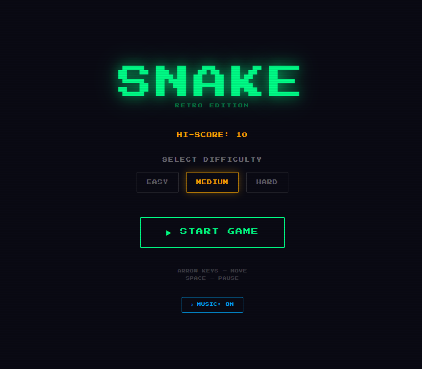
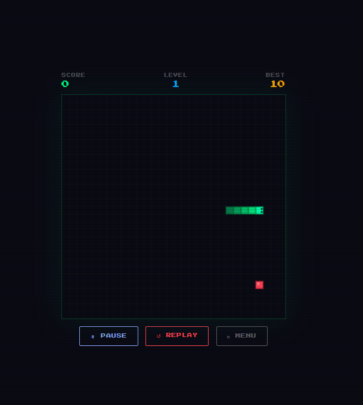
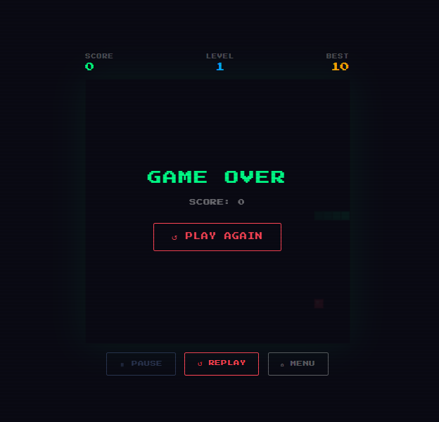

# 🐍 Snake — Retro Edition

A classic Snake game built from scratch using vanilla HTML, CSS, and JavaScript. No frameworks, no libraries — just clean browser code with a retro arcade aesthetic.

<p align="center">
  
</p>

<p align="center">
  <a href="https://ajunabia228.github.io/snake-game/">
    
  </a>
</p>

---

## Gameplay

Use the arrow keys to guide the snake. Eat the red food to grow and score points. Don't hit the walls or yourself!

<p align="center">
  
</p>

<p align="center">
  <table align="center">
    <tr>
      <th>Key</th>
      <th>Action</th>
    </tr>
    <tr>
      <td align="center"><code>↑ ↓ ← →</code></td>
      <td>Move snake</td>
    </tr>
    <tr>
      <td align="center"><code>Space</code></td>
      <td>Pause / Resume</td>
    </tr>
  </table>
</p>

<p align="center">
  
</p>

<p align="center">😱 Make sure not to collide into the walls or else the game's over! 😱</p>

---

## Features

- 🎮 Start menu with difficulty selection (Easy / Medium / Hard)
- ⏱ Countdown timer before each game starts
- 📈 Level system — speed increases as you score higher
- 🏆 Persistent high score saved in your browser
- 🔊 Chiptune background music + sound effects (Web Audio API)
- ⏸ Pause, Replay, and Menu buttons
- 👁 Snake eyes that follow direction
- 🎨 Retro scanline aesthetic with subtle canvas grid

---

## Run locally

```bash
git clone https://github.com/ajunabia228/snake-game.git
cd snake-game
```

Then open `index.html` in your browser, or use the **Live Server** extension in VS Code.

---

## Built with

<p align="center">
  <a href="https://developer.mozilla.org/en-US/docs/Web/HTML">
    
  </a>
  <a href="https://developer.mozilla.org/en-US/docs/Web/CSS">
    
  </a>
  <a href="https://developer.mozilla.org/en-US/docs/Web/JavaScript">
    
  </a>
  <a href="https://developer.mozilla.org/en-US/docs/Web/API/Web_Audio_API">
    
  </a>
</p>

---

## Credits

Base game logic adapted from [Think like a programmer: How to build Snake](https://www.freecodecamp.org/news/think-like-a-programmer-how-to-build-snake-using-only-javascript-html-and-css-7b1479c3339e/) by Panayiotis Nicolaou on freeCodeCamp. Extended with additional features and UI improvements.

Font: [Press Start 2P](https://fonts.google.com/specimen/Press+Start+2P) by CodeMan38, via Google Fonts (SIL Open Font License)
